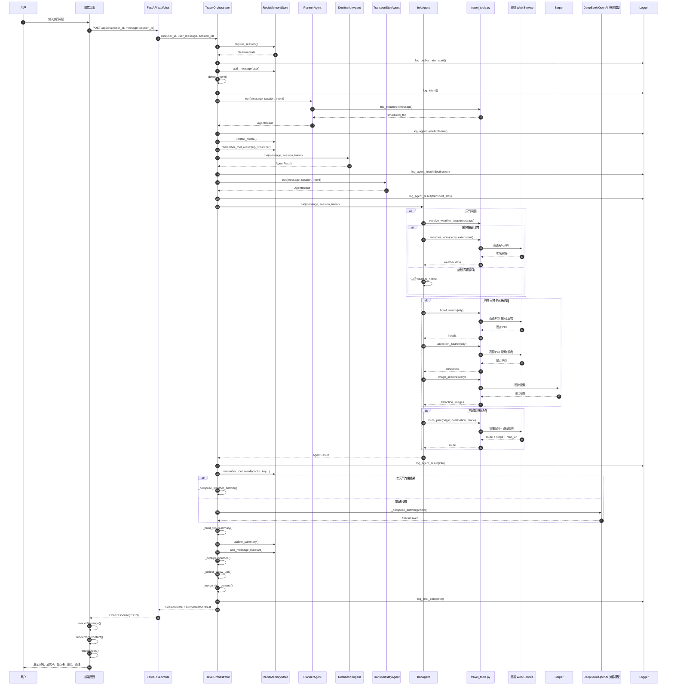
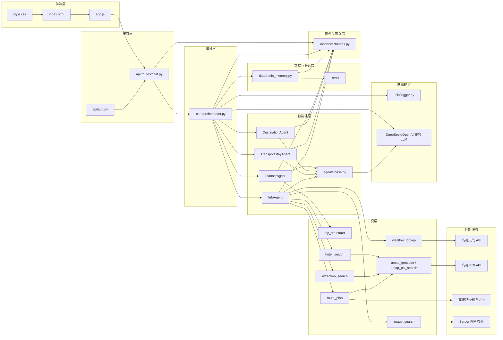
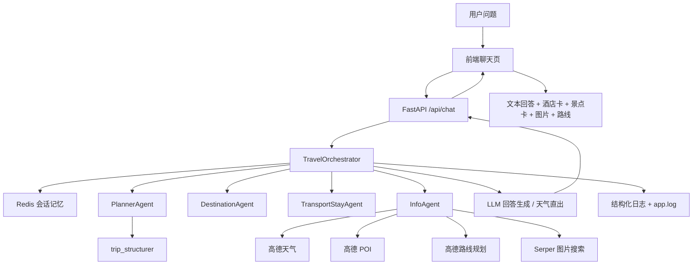

# 旅行小助手

基于 `FastAPI + Redis + 多 Agent 编排 + 高德 Web Service API` 的旅行顾问智能体。  
项目支持多轮对话、结构化旅行需求提取、酒店与景点推荐、景点图片展示、地图路线引导、旅行偏好卡片选择、计划 PDF 导出，以及基于 Redis 的短期记忆。

---

## 项目概览

这个项目的目标不是只做一个“会聊天的旅游问答框”，而是做一个具备基础旅行产品能力的智能体系统：

- 前端负责承接自然语言输入与结果展示
- 后端负责意图识别、会话管理、多 Agent 协作和结果整合
- Redis 负责短期记忆和工具缓存
- 高德接口负责天气、POI、路线等实时能力
- 图片搜索负责景点视觉展示
- LLM 负责自然语言理解、汇总与最终回答生成

当前系统已经具备这些能力：

- 问答式旅行顾问
- Redis 短期记忆
- 多 Agent 编排
- 规则 + LLM 混合意图识别
- 高德天气查询
- 高德酒店 / 景点 POI 搜索
- 高德路线规划
- 地点解析与模糊位置纠错
- 多景点顺路排序
- 餐饮 / 用餐建议
- 景点图片展示
- 彩色旅行偏好卡片
- 行程 PDF 导出
- 日志记录与执行追踪

---

## 当前前端体验

当前前端已经不是简单的聊天框，而是一体化旅行工作台：

- 顶部 Hero 区采用艺术字标题
- 旅行偏好做成彩色卡片，可直接点选
- 中间区域展示多轮对话
- 下方可展示酒店、景点、图片、用餐、路线等富内容卡片
- 右上角可直接导出当前会话为 PDF 计划书

PDF 导出目前包含：

- 封面页
- 行程摘要页
- 酒店 / 景点 / 用餐卡片式摘要
- 路线概览
- 对话记录
- 自动带出导出日期和目的地标题

---

## 目录结构

```text
travel-assistant/
├── api/              # FastAPI 入口与聊天路由
├── agents/           # Planner / Destination / TransportStay / Info
├── core/             # 编排器
├── data/             # Redis 会话与工具缓存
├── frontend/         # 单页旅行工作台前端
├── logs/             # app.log 与 execution_*.jsonl
├── models/           # Pydantic 数据模型
├── skills/           # 官方 SKILL.md 格式的 agent skills
├── tests/            # pytest 测试
├── tools/            # 旅行工具函数（高德、图片搜索、结构化提取）
└── utils/            # 日志工具
```

当前已接入的 agent skills：

- `skills/place-resolver/SKILL.md`
- `skills/smart-stop-order/SKILL.md`
- `skills/meal-planner/SKILL.md`

这些 skills 采用官方 `SKILL.md` 目录格式，并且已经实际接入当前项目逻辑：

- `place-resolver`
  - 解决模糊地点表达、附近/周边/片区词解析
- `smart-stop-order`
  - 对多景点做轻量顺路排序，减少折返
- `meal-planner`
  - 补充早餐 / 午餐 / 晚餐建议，让推荐更完整

---

## 环境变量

复制 `.env.example` 为 `.env` 后配置：

```env
DEEPSEEK_API_KEY=your-api-key
DEEPSEEK_BASE_URL=https://api.deepseek.com
MODEL_NAME=deepseek-chat

REDIS_HOST=localhost
REDIS_PORT=6379
REDIS_DB=0
REDIS_PASSWORD=
SESSION_TTL_MINUTES=60
MAX_HISTORY_MESSAGES=12

SERPER_API_KEY=your-serper-key
AMAP_WEB_API_KEY=your-amap-key

CORS_ORIGINS=*
```

说明：

- `DEEPSEEK_API_KEY`：用于最终自然语言回答生成
- `REDIS_*`：用于短期记忆和工具缓存
- `SERPER_API_KEY`：用于景点图片搜索
- `AMAP_WEB_API_KEY`：用于天气、POI、路线规划

---

## 启动方式

```bash
cd /Users/lixun/Documents/github_code/agent集合/travel-assistant
source .venv/bin/activate
uvicorn api.app:app --port 8010
```

访问：

- 首页：`http://127.0.0.1:8010`
- 健康检查：`http://127.0.0.1:8010/api/health`
- 技能目录接口：`http://127.0.0.1:8010/api/skills`

如果 `8010` 端口已被占用，可以先停止旧进程再启动：

```bash
lsof -nP -iTCP:8010 -sTCP:LISTEN
kill <PID>
```

---

## 核心模块补充

除了原有的 `Planner / Destination / TransportStay / Info` 四个 agent，当前还有两层“能力”概念：

1. 用户侧旅行偏好
- 用于影响推荐风格
- 例如：预算优化、美食雷达、出片路线、亲子友好、Citywalk、雨天备选

2. Agent skills
- 用于增强 agent 的内部执行能力
- 当前已接入官方格式 skill：
  - `place-resolver`
  - `smart-stop-order`
  - `meal-planner`

前者偏“用户想要什么风格”，后者偏“agent 如何更好地完成任务”。

---

## 系统主流程图

这张图描述的是一次完整请求从“用户输入”到“结果渲染”的全流程，也是这个项目最核心的一张图。

它重点回答 3 个问题：

- 用户的一句话是如何被拆成多个子任务的
- 多个 Agent 和工具是如何协作的
- 最终回答、酒店卡、景点卡、图片和路线是如何一起生成的

```mermaid
flowchart TD
    A["用户打开前端页面
    frontend/index.html + app.js"] --> B["用户输入问题
    例如: 上海五一的天气怎么样"]
    B --> C["前端 POST /api/chat
    body: user_id, message, session_id"]

    subgraph API["FastAPI 接入层"]
        C --> D["api/routes/chat.py
        get_orchestrator()"]
        D --> E["TravelOrchestrator.run(user_id, user_message, session_id)"]
    end

    subgraph Session["Redis 短期记忆"]
        E --> F["RedisMemoryStore.require_session()
        1. 有 session_id -> get_session()
        2. 无 session -> create_session()"]
        F --> G["add_message(user)
        写入用户消息
        超过 max_history 时裁剪"]
    end

    subgraph Log1["日志与追踪"]
        E --> H["ExecutionTraceLogger.log_orchestrator_start()"]
        H --> I["ExecutionTraceLogger.log_intent()"]
    end

    G --> J["detect_intent()
    关键字匹配 TravelIntent
    weather_check / itinerary_generation /
    budget_planning / transport_advice /
    destination_choice / qa"]

    subgraph Agents["多 Agent 顺序编排"]
        J --> K["PlannerAgent.run()
        调用 trip_structurer"]
        K --> K1["提取结构化字段
        origin / destination / days /
        budget / travelers / preferences"]
        K1 --> K2["若字段缺失
        生成 follow_up_questions"]
        K2 --> K3["返回:
        summary / confidence /
        trip_profile_updates /
        tool_calls / reasoning_trace"]

        K3 --> L["DestinationAgent.run()"]
        L --> L1["基于 session.trip_profile.destination
        生成目的地玩法 / 季节 / 人群建议"]
        L1 --> L2["返回 summary / reasoning_trace"]

        L2 --> M["TransportStayAgent.run()"]
        M --> M1["基于 origin -> destination
        生成交通方式 / 住宿区域建议"]
        M1 --> M2["返回 summary / reasoning_trace"]

        M2 --> N["InfoAgent.run()"]
    end

    subgraph InfoAgent["InfoAgent 详细决策"]
        N --> N1{"是否天气问题?"}
        N1 -- "是" --> N2["resolve_weather_target(message)
        识别 今天/现在/五一/具体月日"]
        N2 --> N3{"是否超出高德预报窗口?"}
        N3 -- "是" --> N4["生成 weather_notice
        明确说明:
        当前没有精确实时预报
        不再使用旧网页文章替代"]
        N3 -- "否" --> N5["invoke_tool_cached(weather_lookup)
        参数: city + extensions"]
        N5 --> N6["weather_lookup()
        -> 高德天气 API"]
        N6 --> N7["返回:
        live 实况 或 forecast 预报"]

        N1 -- "否" --> N8["跳过天气工具"]

        N7 --> N9{"是否规划/交通/目的地问题?"}
        N4 --> N9
        N8 --> N9

        N9 -- "是" --> N10["invoke_tool_cached(hotel_search)"]
        N10 --> N11["hotel_search()
        -> amap_poi_search(city, 酒店)
        -> 高德 POI"]
        N11 --> N12["结构化酒店卡片
        name / address / area_hint /
        booking_url / distance / location"]

        N12 --> N13["invoke_tool_cached(attraction_search)"]
        N13 --> N14["attraction_search()
        -> amap_poi_search(city, 景点)
        -> 高德 POI"]
        N14 --> N15["结构化景点卡片
        name / description / detail_url /
        location / business_area"]

        N15 --> N16["invoke_tool_cached(image_search)"]
        N16 --> N17["image_search()
        -> Serper 图片搜索
        用于景点图片展示"]

        N17 --> N18{"origin 和 destination 都存在?"}
        N18 -- "是" --> N19["invoke_tool_cached(route_plan)"]
        N19 --> N20["route_plan()
        1. geocode_place()
        2. 优先 amap_geocode()
        3. 调用高德路径规划 API
        4. 生成 map_url + steps"]
        N18 -- "否" --> N21["跳过路线规划"]

        N9 -- "否" --> N22["不做酒店/景点/路线补充"]
    end

    N20 --> O["InfoAgent 返回 AgentResult
    包含:
    summary
    tool_calls
    reasoning_trace
    sources
    rich_content:
    hotels / attractions /
    attraction_images / route /
    weather / weather_notice"]
    N21 --> O
    N22 --> O
    N7 --> O
    N4 --> O

    subgraph AfterEachAgent["每个 Agent 执行后处理"]
        O --> P["orchestrator 收集 agent_results"]
        P --> Q{"有 trip_profile_updates ?"}
        Q -- "有" --> R["memory_store.update_profile()"]
        Q -- "无" --> S["跳过画像更新"]

        R --> T["遍历 tool_calls"]
        S --> T
        T --> U["remember_tool_result()
        按 cache_key 写入 Redis tool_memory"]
        U --> V["trace_logger.log_tool_memory_write()"]
        V --> W["重新 get_session()
        获取最新 session 状态"]
    end

    W --> X{"全部 agent 完成?"}
    X -- "否" --> L
    X -- "是" --> Y["进入回答生成阶段"]

    subgraph Answer["最终回答生成"]
        Y --> Z{"是否存在 weather_notice /
        weather 数据?"}
        Z -- "是" --> AA["_compose_weather_answer()
        直接程序化生成天气回答
        避免 LLM 二次引入旧网页信息"]
        Z -- "否" --> AB{"LLM 可用?"}
        AB -- "是" --> AC["_compose_answer()
        将:
        intent
        trip_profile
        最近上下文
        agent summaries
        拼成 prompt
        -> ChatOpenAI"]
        AB -- "否" --> AD["_fallback_answer()
        返回保守文本"]
    end

    AA --> AE["_build_trip_summary()
    汇总:
    origin / destination /
    days / budget /
    agent summary"]
    AC --> AE
    AD --> AE

    subgraph Persist["结果落库与响应组装"]
        AE --> AF["update_summary(session.summary)"]
        AF --> AG["add_message(assistant)
        保存最终回答"]
        AG --> AH["_dedupe_sources()
        去重 sources"]
        AH --> AI["_collect_follow_ups()
        汇总追问建议"]
        AI --> AJ["_merge_rich_content()
        合并:
        hotels / attractions /
        attraction_images / route /
        weather / weather_notice"]
        AJ --> AK["构造 OrchestratorResult
        answer / sources /
        follow_up_questions /
        trip_summary / tool_calls /
        intent / confidence /
        agent_sequence /
        agent_details /
        rich_content"]
        AK --> AL["trace_logger.log_chat_complete()"]
    end

    subgraph Response["API 响应给前端"]
        AL --> AM["api/routes/chat.py
        构造 ChatResponse"]
        AM --> AN["metadata:
        intent
        confidence
        agent_sequence
        tool_calls
        trip_summary
        rich_content
        debug"]
        AN --> AO["返回 JSON 给前端"]
    end

    subgraph Frontend["前端渲染"]
        AO --> AP["renderMessage()
        渲染 assistant 文本 + sources"]
        AP --> AQ["renderRichContent()
        渲染:
        酒店推荐卡
        热门景点卡
        景点图片网格
        路线引导卡"]
        AQ --> AR["renderChips()
        渲染 suggested_actions"]
        AR --> AS["用户继续追问
        携带 session_id 进入下一轮"]
    end

    subgraph Infra["外部依赖"]
        N6 --> IA["高德天气 API"]
        N11 --> IB["高德 POI 搜索"]
        N14 --> IC["高德 POI 搜索"]
        N20 --> ID["高德路径规划 API"]
        N17 --> IE["Serper 图片搜索"]
        F --> IF["Redis 会话存储
        key: travel:session:*"]
        AC --> IG["DeepSeek / OpenAI 兼容模型"]
    end
```



### 这张图的阅读重点

- `PlannerAgent` 负责“把自然语言拆成结构化需求”
- `InfoAgent` 是当前最重的 agent，承担天气、酒店、景点、图片、路线
- 天气问题已经改成高德优先，不再依赖旧网页搜索
- Redis 不只是存对话，还存工具缓存和旅行画像
- 最终回答不是固定全靠模型，有一部分场景会程序化直出

---

## 时序图

这张图强调的是调用顺序，适合回答“这次请求到底先干了什么、后干了什么”。

如果你要排查某条请求异常，或者解释“为什么 Redis 里会多出这些缓存”，时序图最直观。



### 这张图的阅读重点

- 编排器是主入口，所有 agent 都由它统一调度
- Redis 在请求开始、工具缓存保存、回复落库这几处都会参与
- 高德和 Serper 都不是直接由前端调用，而是后端工具层统一调用
- 最终回答并不总是交给 LLM，天气场景会程序化生成

---

## 模块架构图

这张图更适合解释“代码分层”和“依赖关系”。

如果你要给别人做项目交接，或者自己后面拆模块，这张图最有帮助。



### 这张图的阅读重点

- 前端和后端通过 `/api/chat` 解耦
- `core/orchestrator.py` 是系统核心
- agent 负责“思考与分工”
- tools 负责“实时数据能力”
- data 层负责会话和缓存
- 外部能力已经明显分成高德和 Serper 两条线

---

## 简化总览图

如果你只想快速介绍项目，可以用这张图。



---

## 图与代码的对应关系

为了让这些图不只是“好看”，这里给出核心对应关系：

- 会话管理：`data/redis_memory.py`
- 路由入口：`api/routes/chat.py`
- 应用入口：`api/app.py`
- 编排逻辑：`core/orchestrator.py`
- 结构化提取：`agents/planner.py`
- 目的地建议：`agents/destination.py`
- 交通与住宿建议：`agents/transport_stay.py`
- 实时工具与富内容：`agents/info.py`
- 高德 / 图片工具：`tools/travel_tools.py`
- 执行日志：`utils/logger.py`

---

## 当前设计特点

这个项目当前的设计有几个明显特征：

1. `编排优先`
不是让一个 agent 包办一切，而是把问题拆成多个子视角处理。

2. `工具优先`
酒店、景点、天气、路线尽量走结构化工具，而不是让模型凭记忆输出。

3. `会话优先`
Redis 会保存消息、画像、工具缓存和摘要，保证多轮对话连续性。

4. `降级可控`
天气类问题在超出预报窗口时，不再拿旧网页文章硬回答，而是明确提示边界。

5. `结果卡片化`
最终输出不仅是文本，还包括酒店、景点、图片和路线等富内容结果。

---

## 适合继续扩展的方向

基于当前架构，后面比较适合继续做这些增强：

- 把图片搜索也逐步替换为更稳定的旅游内容源
- 对酒店和景点增加评分、营业时间、门票等字段
- 增加按天行程生成器
- 增加路线多方案比选
- 增加用户偏好长期记忆
- 增加异常分支和错误恢复图

---

## 运行方式

```bash
cd /Users/lixun/Documents/github_code/agent集合/travel-assistant
source .venv/bin/activate
uvicorn api.app:app --port 8010
```

访问：

- `http://127.0.0.1:8010`

---

## 测试

```bash
.venv/bin/python -m pytest -q
```

当前测试覆盖了这些核心场景：

- 结构化旅行字段提取
- 酒店提示字段提取
- 天气目标日期识别
- orchestrator 基础运行
- rich content 去重
- API 返回结构
